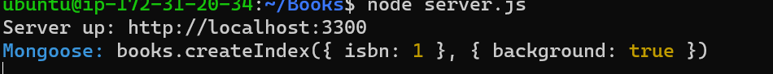

# MERN STACK DEPLOYMENT TO UBUNTU IN AWS 
The task is to implement a simple Book register web form using MEAN stack

MEAN Stack is a combination of the following components:

**.** MongoDB (Document database) – Stores and allows to retrieve data.

**.** Express (Back-end application framework) – Makes requests to Database for Reads and Writes.

**.** Angular (Front-end application framework) – Handles Client and Server Requests 

**.** Node.js (JavaScript runtime environment) – Accepts requests and displays results to end user

# STEPS
**.** Update Ubuntu `sudo apt update` Upgrade `sudo apt upgrade`

**.** Add certificates `sudo apt -y install curl dirmngr apt-transport-https lsb-release ca-certificates`
`curl -sL https://deb.nodesource.com/setup_12.x | sudo -E bash` 

**.** Install Nodejs `sudo apt install -y nodejs`

**.** Install Mongodb
`sudo apt-key adv --keyserver hkp://keyserver.ubuntu.com:80 --recv 0C49F3730359A14518585931BC711F9BA15703C6`
`echo "deb [ arch=amd64 ] https://repo.mongodb.org/apt/ubuntu trusty/mongodb-org/3.4 multiverse" | sudo tee /etc/apt/sources.list.d/mongodb-org-3.4.list`

**.** The book register will have book name, isbn number, author and number of pages

**.** Install Mongodb `sudo apt install -y mongodb`

**.** Start the server `sudo service mongodb start`

**.** Verify that the server is up and running `sudo systemctl status mongodb`

**.** Install npm `sudo apt install -y npm`

**.** Install body parser package, this helps to process JSON files passed in requests to the server `sudo npm install body-parser`

**.** Create a folder named books and cd into books `mkdir Books && cd Books`

**.** In the books directory, initialize npm `npm init` and add a file named server.js  `vi server.js`

**.** Paste the code below into server.js file

**.** Install Express and mongoose `sudo npm install express mongoose`

**.** In ‘Books’ folder, create a folder named app `mkdir apps && cd apps` 

**.** Create a file named routes.js `vi routes.js`

**.** Paste the code below into routes.js

**.** In the ‘apps’ folder, create a folder named models `mkdir models && cd models`

**.** Create a file named book.js `vi book.js`  **.** Paste code below into file

**.** Access the routes with AngularJS, we use AngularJS to connect our web page with Express and perform actions on our book register.

**.** Change the directory back to ‘Books’ and Create a folder named public `mkdir public && cd public`

**.** Add a file named script.js `vi script.js`  **.** Paste code below into file

**.** In public folder, create a file named index.html; `vi index.html`  **.** Paste code below into file

**.** Change the directory back up to Books `cd..` Start the server by running this command: `node server.js`

**.** To confirm its working fine, we will see the screenshot below

**.** Open TCP port 3300 in AWS Web Console for our EC2 Instance.

**.** This is how our Web Book Register Application looks like in browser:

